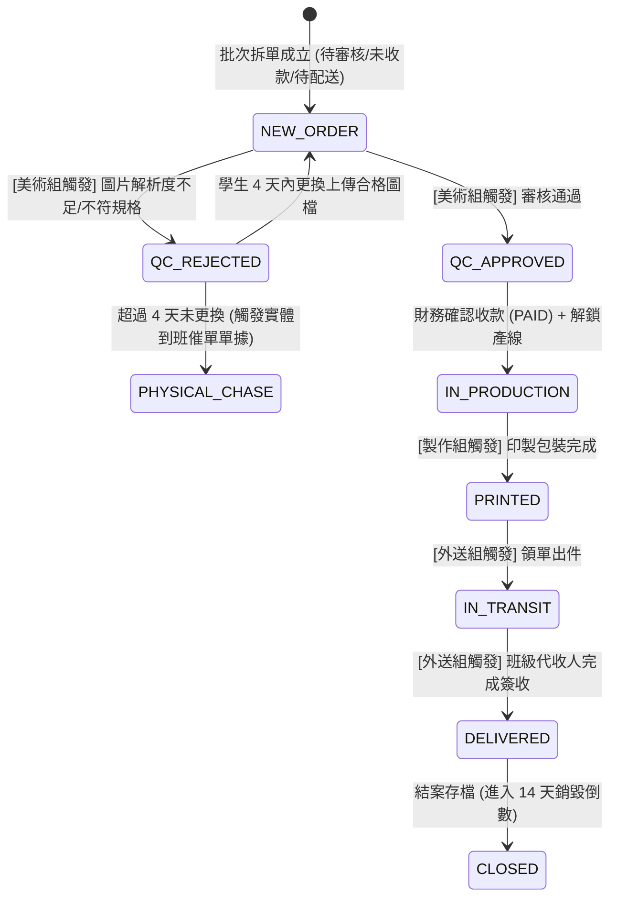

# 115校慶園遊會客製化訂單與產線調度系統

## 頂級零元長青系統前期架構規範書 (Pure System Architecture Specification)

---

### [專業角色]

**頂尖分散式系統架構師兼開源成本優化顧問**（專精高可用性、Serverless 零元高防禦架構）。

---

### [蘇格拉底深度架構審查 (Socratic Architectural Inquiries)]

1. **圖檔雲端儲存架構之容錯與成本策略：**
   * **問題**：純靠單一免費服務（如 Firebase Storage 5GB 額度或 Cloudinary 25GB Credits）在校慶大圖密集上傳時是否存在斷流風險？
   * **架構決策**：
     * **主通道**：**Cloudinary Free Tier**（每月提供 25 個點數，約可處理 25GB 圖檔存儲與頻寬，且原生具備動態圖片縮圖、WebP 轉換與 DPI 分析 API）。
     * **備援與長青通道**：**Firebase Storage Spark Plan**（提供 5GB 免費純存儲空間，搭配客戶端圖片壓縮管線）。
     * **降級機制**：前端在上傳圖檔時，先於客戶端 Canvas 執行無失真/高質量壓縮（限制在最大 2048px、300DPI 預備級別），若 Cloudinary 上傳響應非 200，立即自動切換至 Firebase Storage，實現雙向透明容錯。

2. **跨平台協議與行動 App 升級相容性：**
   * **問題**：未來若升級為原生行動 App（React Native / Flutter），現有設計是否需要重構？
   * **架構決策**：
     * 架構採用 **Client-agnostic（客戶端無關）** 設計。
     * 所有資料互動封裝為統一的 SDK/Repository 介面層（抽象資料存取層 Data Access Layer, DAL），通訊合約嚴格遵循 JSON Schema 與 Firestore Realtime SDK 協議。
     * 未來無論是 Web SPA（Vue/React）、PWA 還是原生 Flutter/React Native，只需調用同一套 Repository 介面，無需改動底層資料拓撲與安全規則。

---

## 壹、 頂級免費長青技術基礎架構選型 (Zero-Cost Long-Term Stack)

```text
[ 用戶端 (跨平台 Web / PWA / 手機 App) ]
               │
               ▼ (HTTPS / TLS 1.3 + WSS WebSocket)
[ CDN 與靜態邊緣節點：GitHub Pages / Cloudflare Pages (永久免費、無限流量、全域 Anycast 防 DDoS) ]
               │
               ▼ (REST API / 長連線雙向 PubSub 通訊)
[ 雲端即時無伺服器大腦：Google Firebase Firestore (Spark 免費方案) ]
               ├─ 讀取配額：每日 50,000 次 (校慶尖峰綽綽有餘)
               ├─ 寫入配額：每日 20,000 次 (可支撐上萬件客製拆單)
               ├─ 儲存空間：1 GB 結構化資料 (可容納上百萬筆文字工單)
               └─ 連線能力：同時在線 1,000,000 連線 (全校師生併發不卡頓)
```

| 架構層級 | 選定技術/平台 | 服務方案 | 免費配額/優勢 | 角色與職責 |
| :--- | :--- | :--- | :--- | :--- |
| **邊緣節點 (Edge / CDN)** | Cloudflare Pages / GitHub Pages | Free Tier | 無限頻寬、全球 Anycast CDN、自動 SSL/TLS 1.3、內建 DDoS 防禦 | 靜態資產分發、單頁應用路由、客戶端快取 |
| **無伺服器資料庫 (Database)** | Google Cloud Firestore | Spark Plan (Always Free) | 每日 50k 讀、20k 寫、1GB 存儲、100 萬同時長連線 | 即時狀態廣播、ACID 批次寫入、離線快照暫存 |
| **資產管線 (Media Storage)** | Cloudinary + Firebase Storage | Free Tier (雙軌) | Cloudinary 25GB/月 + Firebase 5GB 永續存儲 | 高解析圖檔永久鏈接、客戶端 EXIF/DPI 解析 |
| **通訊協定 (Protocol)** | Firestore Realtime SDK (WSS) + REST | 標準協定 | < 300ms 端到端廣播延遲、事件驅動 Pub/Sub | 實時印製進度看板同步、外送追蹤 |

---

## 貳、 核心資料實體模型設計 (Data Entity Architecture)

資料庫內部採取 NoSQL 文件型結構，建立高內聚、低耦合的集合規劃：

### 1. 學生會員實體 (`students/{student_id}`)

* **識別鍵 (Primary Key)**：`student_id`（固定 6 碼數字，正則 `^[0-9]{6}$`，例如學號）
* **屬性清單**：

  ```json
  {
    "student_id": "113001",
    "name": "陳大明",
    "class_code": "DP-1R",
    "seat_number": 12,
    "gender": "MALE",
    "phone": "0912345678",
    "security_token": "e3b0c44298fc1c149afbf4c8996fb92427ae41e4649b934ca495991b7852b855",
    "created_at": "SERVER_TIMESTAMP"
  }
  ```

* **約束邏輯 (Constraint Logic)**：
  1. **複合唯一性防撞**：客戶端與安全性規則雙重檢驗 `class_code + "_" + seat_number`。在同一個班級中，座號具唯一性，杜絕冒名與重複註冊。
  2. **不可變性 (Immutability)**：除具備 `SUPER_ADMIN`（總召）權限外，一般使用者一旦寫入成功即鎖定，禁止一般客戶端發起 `UPDATE` 或 `DELETE`。

### 2. 生產工單實體 (`work_orders/{work_order_id}`)

* **識別鍵 (Primary Key)**：`work_order_id`（格式：`母訂單號-品項代碼`，例：`115-2026-0001-MUG`）
* **屬性清單**：

  ```json
  {
    "work_order_id": "115-2026-0001-MUG",
    "parent_order_id": "115-2026-0001",
    "slip_serial": "TR-1001",
    "student_ref": "113001",
    "student_snapshot": {
      "name": "陳大明",
      "class_code": "DP-1R",
      "seat_number": 12,
      "phone": "0912345678"
    },
    "product_spec": {
      "code": "MUG",
      "name": "客製陶瓷馬克杯",
      "unit_price": 150,
      "qty": 2,
      "subtotal": 300
    },
    "asset_pipeline": {
      "raw_image_url": "https://res.cloudinary.com/demo/image/upload/v115/orders/115-2026-0001-MUG.png",
      "backup_image_url": "https://firebasestorage.googleapis.com/v0/b/.../orders/115-2026-0001-MUG.png",
      "pixel_width": 2400,
      "pixel_height": 1800,
      "dpi": 300,
      "res_status": "HIGH_RES"
    },
    "fsm_state": {
      "finance_status": "UNPAID",
      "qc_status": "PENDING_REVIEW",
      "production_status": "STANDBY",
      "logistics_status": "PENDING_DELIVERY",
      "rejected_reason": null,
      "rejected_at": null,
      "qc_passed_at": null,
      "printed_at": null,
      "delivered_at": null
    },
    "created_at": "SERVER_TIMESTAMP"
  }
  ```

---

## 參、 業務邏輯與自動拆單演算法架構 (Business & Split Order Logic)

### 智慧拆單引擎流程圖 (Smart Order Splitting Algorithm)

```mermaid
graph TD
    A[前端購物車 CartItems[] + StudentProfile] --> B[步驟 1: 生成母單序號 ParentID]
    B --> C[步驟 2: 遍歷 CartItems 依 ProductCode 執行品項聚合]
    C --> D{該品項代碼是否已存在?}
    D -- 是 --> E[累加數量 Qty 與小計 Subtotal]
    D -- 否 --> F[建立該品項聚合節點]
    E --> G[步驟 3: 工單分裂 Order Spawning]
    F --> G
    G --> H[為每個獨立品項建立 WorkOrder 實體並指派 TR-XXXX 三聯號]
    H --> I[步驟 4: Firestore WriteBatch / Transaction 原子性提交]
    I --> J((成功廣播至產線與財務看板))
```

### 拆單演算法虛擬代碼 (Pure Algorithmic Specification)

```text
Algorithm: SmartOrderSplitAndBatchCommit
Input: 
    cart_items: List of Item(code, name, price, qty, image_meta)
    student_profile: StudentProfile
    notes: String
Output: 
    TransactionResult(parent_id, work_order_ids[])

Begin:
    1. parent_id := "115-2026-" + GenerateTimestampBase36Hex()
    2. aggregate_map := Map<String, AggregatedItem>()

    3. For Each item in cart_items:
           If aggregate_map.has(item.code):
               node := aggregate_map.get(item.code)
               node.qty := node.qty + item.qty
               node.subtotal := node.subtotal + (item.price * item.qty)
               // 補充或更新圖檔資產陣列
           Else:
               aggregate_map.set(item.code, New AggregatedItem(
                   code = item.code,
                   name = item.name,
                   unit_price = item.price,
                   qty = item.qty,
                   subtotal = item.price * item.qty,
                   asset = item.image_meta
               ))
       End For

    4. work_orders := List<WorkOrder>()
    5. counter := 1
    6. For Each (prod_code, agg) in aggregate_map:
           work_order_id := parent_id + "-" + prod_code
           slip_serial := "TR-" + GetGlobalNextSequence(counter)
           
           wo := InstantiateWorkOrder(
               id = work_order_id,
               parent_id = parent_id,
               slip_serial = slip_serial,
               student = student_profile,
               spec = agg,
               initial_fsm = {
                   finance_status: "UNPAID",
                   qc_status: "PENDING_REVIEW",
                   production_status: "STANDBY",
                   logistics_status: "PENDING_DELIVERY"
               }
           )
           work_orders.append(wo)
           counter := counter + 1
       End For

    7. Begin Atomic WriteBatch (batch):
           For Each wo in work_orders:
               batch.set("work_orders/" + wo.id, wo)
           End For
           Commit batch to Cloud Firestore
    8. Return TransactionResult(parent_id, [wo.id for wo in work_orders])
End
```

---

## 肆、 權限控管與狀態機架構 (RBAC & FSM Engine)

### 1. 12 人 RBAC 權限與資料脫敏架構 (Data Masking & Projection)

```text
[ 雲端主資料庫 (Firestore) ]
       │
       ├─► 總召 (SUPER_ADMIN)：全欄位解鎖、全狀態改寫權限、全校原始資料
       │
       ├─► 財務組 (FINANCE)：僅解鎖金額、收款狀態、套表與 Excel 匯出
       │                      [美術審核 / 外送狀態 ➔ 唯讀鎖定]
       │
       ├─► 美術組 (QC_REVIEWER)：僅解鎖圖檔連結、解析度數據與「審核狀態」
       │                         [學生電話、財務金額 ➔ 遮蔽為 ***]
       │
       ├─► 產線製作 (PRODUCTION)：僅解鎖圖檔下載與「印製狀態」
       │                          [學生電話、座號、金額 ➔ 全面遮蔽]
       │
       └─► 外送物流 (LOGISTICS)：僅解鎖班級、座號、姓名與「配送狀態」
                                 [學生電話 ➔ 遮蔽為 09******XX，禁止匯出總表]
```

#### RBAC 欄位遮蔽與授權矩陣表

| 欄位 / 權限 | SUPER_ADMIN (總召) | FINANCE (財務組) | QC_REVIEWER (美術組) | PRODUCTION (產線組) | LOGISTICS (外送組) |
| :--- | :---: | :---: | :---: | :---: | :---: |
| **學生姓名** | 完全顯示 | 完全顯示 | 完全顯示 | 遮蔽 (僅顯示工單編號) | 完全顯示 |
| **班級與座號** | 完全顯示 | 完全顯示 | 遮蔽 (僅顯示科別) | 完全遮蔽 | 完全顯示 (配送依據) |
| **學生手機** | 完全顯示 | 完全顯示 | 完全遮蔽 (`***`) | 完全遮蔽 (`***`) | 動態脫敏 (`09****1234`) |
| **訂單金額/小計** | 讀寫 | 讀寫 (收款確認) | 完全遮蔽 (`***`) | 完全遮蔽 (`***`) | 完全遮蔽 (`***`) |
| **原始圖檔下載** | 完全授權 | 唯讀預覽 | 完整高解析下載審核 | 完整下載切片 | 無權存取 |
| **狀態改寫權限** | 全權限 | 僅限 `finance_status` | 僅限 `qc_status` | 僅限 `production_status` | 僅限 `logistics_status` |

---

### 2. 工單生命週期有限狀態機 (Finite State Machine)



#### FSM 轉移規則與保護條件 (Guard Conditions)

1. **印製解鎖守門條件 (Production Gate)**：
   * `qc_status == 'QC_APPROVED'` 且 `finance_status == 'PAID'` 時，`production_status` 始可由 `STANDBY` 轉為 `IN_PRODUCTION`。
2. **退件時限與到班催單守門條件 (Rejection Timeout Guard)**：
   * 當 `qc_status == 'QC_REJECTED'`，系統記錄 `rejected_at = now()`。
   * 排程判斷若 `now() - rejected_at > 4 days`，自動將該工單標註 `CHASE_REQUIRED = true`，自動推入【實體催單報表列印管線】。

---

## 伍、 A4 三聯確認單與報表輸出邏輯架構 (Output Pipelines)

### 1. 三聯單邏輯分層規格 (Triple-Slip Specification)

資料流由單一 `WorkOrder` 實體動態映射至輸出引擎的三個邏輯聯：

```text
+------------------------------------------------------------------------+
| 【第一聯：顧客取貨存根聯 (Customer Stub)】                              |
| - 工單編號 (Barcode/QRCode) | 品項名稱與數量 | 大會防偽編號 (TR-XXXX)     |
| - 領件注意事項與驗收簽名欄位                                            |
+------------------------------------------------------------------------+
| 【第二聯：行政派送班級聯 (Logistics Slip)】                            |
| - 外送目標班級、座號、收件人全名 | 派送梯次代碼                          |
| - 班級代收幹部簽收欄 | 派送員驗訖章欄位                                  |
+------------------------------------------------------------------------+
| 【第三聯：財務出納核銷聯 (Finance Audit Slip)】                        |
| - 應收小計金額 | 中文大寫數字轉換器（例：150 -> 壹佰伍拾元整）             |
| - 實收狀態核章欄 | 財務流水號                                           |
+------------------------------------------------------------------------+
```

### 2. 智慧報表直連引擎架構 (Dynamic Formula Injection)

產出供產線離線查看之 CSV / 試算表時，嚴禁輸出純文字非點擊網址，採用動態公式封裝：

$$\text{Cell Formula} = \text{"=HYPERLINK(\""} + \text{raw\_image\_url} + \text{"\", \"點擊開啟原圖\")"}$$

產線終端操作人員於 Excel 或 Google Sheets 中單擊即可直接叫用瀏覽器調用全解析度無失真製程圖檔。

---

## 陸、 前後台線上即時通訊與抗災防禦機制 (Resilience & Sync Protocol)

### 1. 雙向長連線事件驅動機制 (Pub/Sub Sync Protocol)

* **傳輸管道**：Firestore WebSocket Secure (WSS) 雙向多工通道。
* **廣播延遲**：前台寫入 WriteBatch 觸發雲端變更至所有管理監控看板之廣播延遲 $\le 300\text{ ms}$。
* **零輪詢（Zero Polling）**：全面禁止前端使用 `setInterval` 或遞迴 HTTP 輪詢，杜絕配額消耗。

### 2. 邊緣降級與斷網容錯架構 (Dual-Track Persistence)

* **寫入優先原則 (Local-First Snapshot)**：
  * 客戶端發起任何狀態改寫或下單操作，首先寫入 IndexedDB / LocalStorage 本地持久化快照，立即返回本地操作序號。
* **心跳偵測與排隊佇列 (Queue Flush Pipeline)**：
  * 當網絡中斷（`navigator.onLine === false` 或連線超時），系統進入 `OFFLINE_BUFFER_MODE`。
  * 所有變更寫入本機事務隊列 `OfflineTxQueue`。
  * 網絡恢復時，啟動心跳重新連線，依時間戳記依序向 Firestore 執行提交，保證零資料遺失與狀態最終一致性。

### 3. 活動結案資料長期安全封存政策 (Post-Event Archival Policy)

* **政策變更說明**：原「14 天批次物理銷毀 (Wipeout)」邏輯已於最新架構決策中**完全剔除與暫緩**。
* **封存規範**：
  1. 活動閉幕後，全站訂單與學生名冊轉為只讀歸檔狀態（`ARCHIVED_READONLY`）。
  2. 資料庫永久留存歷史紀錄，供日後校慶活動、財務核銷與重印對帳調閱。
  3. 成員帳籍由 15 人正式矩陣接管維護，維持資料之完整性與可追溯性。
